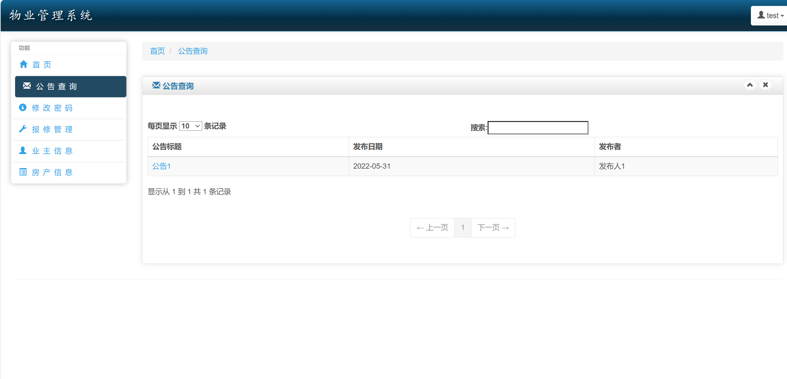

# jspServlet020
jspServlet020小区物业管理系统+BG
 
## 源码问题查看主页咨询

### 一、关键词

小区物业管理系统，物业管理系统

### 二、作品包含
源码+数据库+设计报告文档+全套环境和工具资源+本地部署教程

### 三、项目技术
前端技术：Html、Css、Js、Jquery、Bootstrap
后端技术：Java、JSP、Servlet、JDBC

### 四、运行环境（以下版本亲测，其他版本兼容性请自行测试）
开发工具：IDEA/eclipse

数据库：MySQL5.7或8.0

服务器：Tomcat8.5或Tomcat9.0

数据库管理工具：Navicat10以上版本

环境配置软件： JDK1.8

浏览器：谷歌浏览器

### 五、项目介绍
项目编号：jspServlet020

物业管理系统是现代居住小区不可缺少的一部分。一个好的物业管理系统可以提升小区的管理水平，使小区的日常管理更加方便。将计算机的强大功能与现代的管理思想相结合，建立现代的智能小区是物业管理发展的方向。重视现代化的管理，重视细致周到的服务是小区工作的宗旨。以提高物业管理的经济效益、管理水平，确保取得最大经济效益为目标。

本系统的使用者分为用户（业主）和管理员（物业）两类，根据使用者不同，将有不同的主页，对应不同的功能权限。将本系统分为用户子系统和管理员子系统。
在用户子系统中，使用者通过账号密码（用户）登入系统，进入主页，通过主页链接，进入小区服务，小区公告，信息查询，系统功能四个功能模块，在模块内可以完成报修，查看公告，查询房产相关信息，修改密码，退出系统等功能。
在管理员子系统中，使用者通过帐号密码（管理员）登入系统，进入主页，通过主页链接进入管理员信息管理，物业管理，报修管理，保卫绿化，公告管理，系统功能六个功能模块：在管理员信息管理中可以对管理员使用者的信息进行管理；在物业管理模块中，可以对房产信息和业主信息进行管理；在报修管理中，可以查看报修记录并安排维修人员；在保卫绿化模块中，可以对保安或保洁员的工作进行安排和记录；在公告管理模块中，可以发布公告，查看历史公告；在系统功能模块中可以进行密码管理和退出系统。

### 六、运行截图

